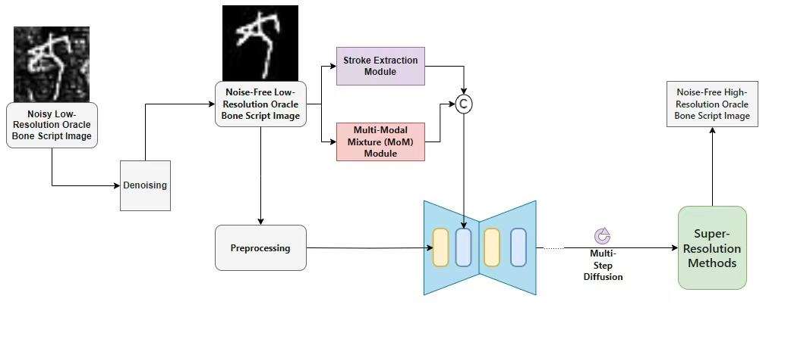
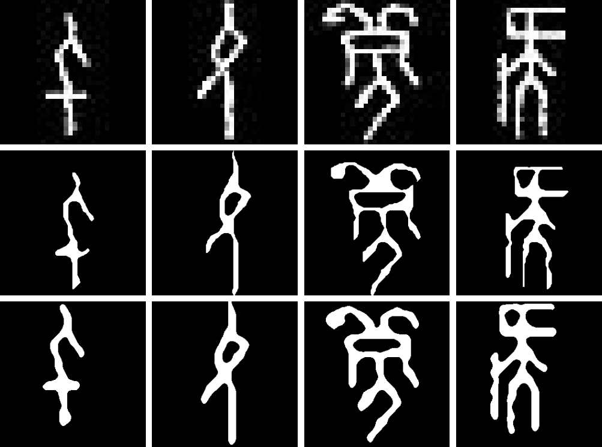

<h1>Super resolution of Oracle Bone Inscription image based on diffusion model</h1>
<b>Authors</b>:
[Shibin Wang]<sup>1</sup>
| [Beigui Li]<sup>2</sup>
| [Xinyu Zhang]<sup>3</sup>
| [Yihang Li]<sup>3</sup>
| [Lu Yu]<sup>3</sup>

## 💬 At the beginning
Before starting to try, please read the following content

#  🛠️ How To Start？
## Dependencies and Installation

In the project, we simplified the naming of Oracle_DM and named it OBSR

- Pytorch >= 1.7.0
- CUDA >= 11.0
```
## Git clone this repository
git clone https://github.com/4C4247/Oracle_DM.git

cd OBSR

## Create new anaconda env
conda create -n OBSR python=3.8

conda activate OBSR
```
## Install the required packages
```
pip install -r requirements.txt
```
## 📢Regarding the function of each file
🌟The files in the IDM folder ensure the framework of our project.

🌟The files in the MoM folder and the utilities folder are the core of the stroke extraction module's operation.

🌟The files in the models folder are the main body of our model.

🌟The train folder contains the scripts required for two-stage model training.

🌟The checkpoins folder contains pretrained models.

## How to train?
 ❗ Just modify the configuration file as needed, and then run different training scripts to start training models with different functions.

If you need to train the stroke extraction model, select [train_stroke_extractor.py](Train/train_stroke_extractor.py) in the Train folder.
```
python train_stroke_extractor.py
```
If you need to train the diffusion model, select [train_two_dage_oracle_tsr.py](Train/train_two_stage_oracle_tsr.py) in the Train folder.
```
python train_two_stage_oracle_tsr.py
```

## How to inference?
 ❗ Enter the image to be tested, then configure and run the script in the [Inference](Inference/inference.py) folder according to the script content.
 ```
 python inference.py
 ```

## Pretrained Models
The pretrained model can be downloaded here[Google Drive](https://drive.google.com/drive/my-drive)

The two models correspond to the diffusion model and stroke extraction model respectively. Simply place them in the correct position to run normally!

## Dataset
The images used in our experiment are all from this [dataset](https://drive.google.com/drive/my-drive) and have been processed using different methods.

## 🔎 Overview of OBSR


<h4>Abstract</h4>
Oracle Bone Inscriptions is the core carrier of Chinese civilization. Super-resolution reconstruction ofOracle Bone Inscriptions images
is very important for the protection of culturalheritage. Super-resolution reconstruction of Oracle Bone Inscriptions images faces many
challenges, especially for those Oracle Bone Inscriptions images with complex strokesand serious degradation due to corrosion.
Under this background, in order to ensure thestructural fidelity of Oracle Bone Inscriptions and realize the high-quality super-resolution
Oracle Bone Inscriptions image reconstruction, this study proposed the OracleDM model,aiming at restoring the Oracle Bone Inscriptions image
 with realistic style and clear strokes. On the self-built Oracle Bone Inscriptions degradation data set, OracleDM has
advantages over the existing super-resolution methods in many aspects. Compared with DiffTSR, the PSNR index is increased by 1.97dB, and the SSIM index
 is increased by 0.027. Our model can not only significantly improve the image resolution and visual quality, but also restore more accurate font details
 while maintaining the structure of Oracle Bone Inscriptions’s strokes. This study combines the diffusion model with the prior of ancient Chinese characters,
providing a new paradigm for digital protection in Oracle Bone Inscriptions and promoting the deep application of deep learning technology in the field of
cultural heritage.

## Visual effect preview

